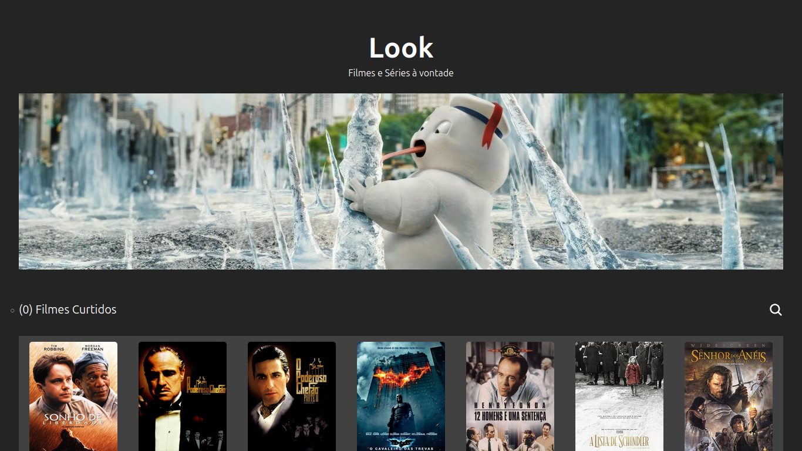

# Client Look

Uma aplicação para gerenciar e visualizar filmes, permitindo que os usuários curtam seus filmes favoritos e visualizem detalhes de cada filme. A aplicação é construída com React para o frontend e Express para o backend.

## Tecnologias Utilizadas

- **Frontend**: React, Redux, React Router
- **Backend**: Node.js, Express
- **Estilo**: SCSS
- **Documentação**: Swagger

## Funcionalidades

- Listar todos os filmes disponíveis.
- Visualizar detalhes de um filme específico.
- Curtir e descurtir filmes.
- Ver filmes curtidos em uma lista separada.
- Pesquisa de filmes.

## Estrutura do Projeto

- moviesApi.ts // Funções para interagir com a API
- store.ts // Configuração do Redux store
- LikedMovies // Componente para exibir filmes curtidos
- MovieDetails // Componente para exibir detalhes do filme
- MovieList // Componente para listar filmes
- moviesSlice.ts // Redux slice para gerenciar o estado dos filmes
- Movie.ts // Interface para o objeto Movie
- index.tsx // Ponto de entrada da aplicação
- package.json // Dependências e scripts

## Instalação

### Pré-requisitos

- Node.js
- NPM ou Yarn

### Configuração do Backend

1. Navegue até a pasta do backend:
   cd backend

2. Instale as dependências:
   npm install
3. Inicie o servidor:
   npm start

### Configuração do Frontend

1. Navegue até a pasta do frontend:
   cd frontend

2. Instale as dependências:
   npm install
3. Inicie o servidor de desenvolvimento:
   npm run dev

## Uso

- Acesse a aplicação web em `http://localhost:5173`.

## Endpoints da API

1. **GET /api/movies** - Retorna a lista de todos os filmes.
2. **GET /api/movies/:id** - Retorna os detalhes de um filme específico pelo ID.

## Contribuição

Sinta-se à vontade para contribuir! Abra uma issue ou envie um pull request.

## Licença

Este projeto está licenciado sob a MIT License. Veja o arquivo `LICENSE` para mais detalhes.
